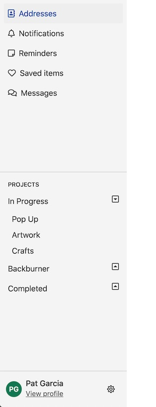

# tachyons-vs-css-modules

_An experiment testing React + Tachyons impact on bundle size._

## Findings

The [comparison script](./scripts/compare.js) demonstrates:

* Components built with Tachyons have a fixed CSS size
* Components built with Tachyons have a larger JS size than components built
  with CSS Modules
* Components built with CSS Modules are lighter invidually and combined

```
┌─────────┬────────────────────────┬──────────────────────────┐
│ (index) │      CSS Modules       │         Tachyons         │
├─────────┼────────────────────────┼──────────────────────────┤
│ Button  │ { JS: 318, CSS: 450 }  │ { JS: 449, CSS: 15055 }  │
│ Sidebar │ { JS: 810, CSS: 703 }  │ { JS: 1057, CSS: 15055 } │
│  Both   │ { JS: 1001, CSS: 888 } │ { JS: 1333, CSS: 15055 } │
└─────────┴────────────────────────┴──────────────────────────┘
```

(All sizes gzipped.)

_Why?_ Tachyons classes, although terse, still occupy more characters than
alternatives like CSS Modules.  This screenshot of the minified Tachyons code
demonstrates the idea:


### Server-side rendering

Comparing CSS Modules to Tachyons using [React's server-side
rendering](https://reactjs.org/docs/react-dom-server.html) reveals the
differences aren't limited to client-side assets:

```shell
$ node scripts/ssr-tachyons.js 2> /dev/null
[tachyons] renderToString, loop x10000: 3786.175344001502 ms
[tachyons] renderToNodeStream, 10 parallel x1000: 3666.955406997353 ms
$ node scripts/ssr-cssmodules.js 2> /dev/null
[cssmodules] renderToString, loop x10000: 3410.5281179994345 ms
[cssmodules] renderToNodeStream, 10 parallel x1000: 3361.1502400003374 ms
```

Less `className` strings result in slightly faster render times.

### Example components

This test uses two components for testing. Both components are coded separately
with CSS Modules and Tachyons, using the same DOM and styles. There's no visual
difference in the components.

#### [Button](./src/Button)

A simple button with a few properties.


#### [Sidebar](./src/Sidebar)

A more complicacted navigation component with some state.



### Setup

1. Make sure [Node.js](https://nodejs.org/en/) 14.x.x is installed
2. Clone the repository
3. Install dependencies in the repository directory:

    ```shell
    npm install
    ```

### Storybook

Run the project's [Storybook](https://storybook.js.org):

```shell
npm start
```

### Build and compare

Run the project's build script and compare file sizes:

```shell
# Clean build directory
npm run clean

# Build the project
npm run build

# Compare file sizes
npm run compare
```

